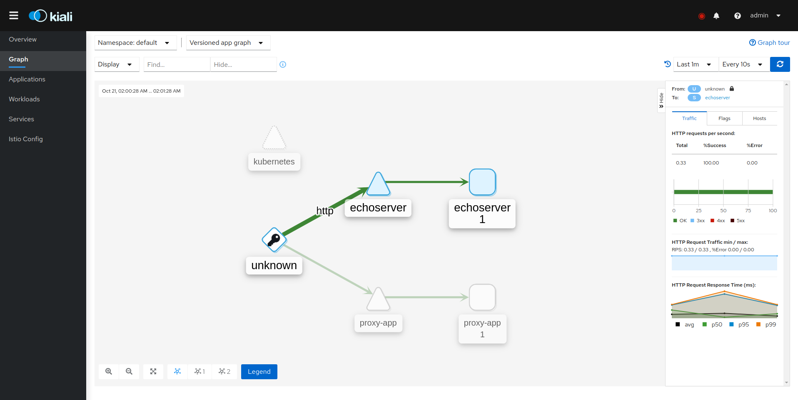
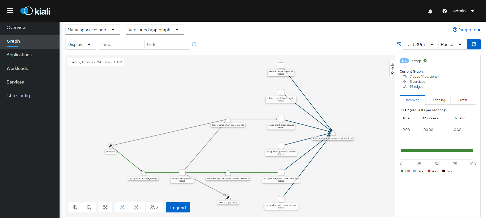

# Практика к занятию по теме "Service mesh на примере Istio"

## Зависимости

Для выполнения задания вам потребуется установить зависимости:

- [VirtualBox](https://www.virtualbox.org/wiki/Downloads)
- [Vagrant](https://www.vagrantup.com/downloads.html)

После установки нужно запустить команду запуска в корне проекта:

```shell script
vagrant up
```

Для совершения всех операций нам понадобится зайти в виртуальную машину:

```shell script
vagrant ssh
```

##Команды для запуска:
istioctl manifest apply -f istio/istio-manifest.yaml
kubectl apply -f istio/kiali-secret.yaml -f istio/defaults.yaml -f app/echoserver.yaml  -f app/proxy-app.yaml
kubectl apply -f istio/defaults.yaml
kubectl apply -f app/echoserver.yaml
kubectl apply -f app/proxy-app.yaml

####kiali
Логин:admin
Пароль:admin

##Карта сервисов выполненного задания в Kiali выглядит таким образом:




## Содержание

* [Задачи](#Задачи)
* [Инструкция по выполнению задания](#Инструкция-по-выполнению-задания)
* [Лайфхаки по выполнению задания](#Лайфхаки-по-выполнению-задания)

## Задачи

Задание состоит из этапов

- Развернуть Istio с включенными метриками сервисов и Kiali
- Развернуть минимум два приложения с Service mesh и сделать к ним несколько запросов
- Отобразить карту сервисов в Kiali

Карта сервисов в Kiali выглядит таким образом:



## Инструкция по выполнению задания

- Сделать форк этого репозитория на Github
- Выполнить задание в отдельной ветке
- Создать Pull request с изменениями в этот репозиторий


## Лайфхаки по выполнению задания

Для выполнения задания вы можете воспользоваться [материалами демо](https://github.com/izhigalko/otus-demo-istio).

Спецификацию IstioOperator можно посмотреть
[в документации Istio](https://istio.io/latest/docs/reference/config/istio.operator.v1alpha1/#IstioOperatorSpec)
или можно посмотреть [исходники манифестов, исполняемых оператором](https://github.com/istio/istio/tree/1.6.4/manifests).

Директория `istio` в корне проекта расшарена в виртуальную машину, вы можете изменять файлы 
в любимом редакторе и применять их в консоли виртуальной машины.

Если вы хотите изменить текущую конфигурацию Istio,
достаточно снова выполнить соответствующую команду с указанием конфигурации:

```shell script
istioctl manifest apply -f istio/istio-manifest.yaml
```

Для выключения шифрования между прокси, нужно применить настройку:

```shell script
kubectl apply -f istio/defaults.yaml
```

Для доступа к какому-либо сервису с хоста можно использовать тип NodePort в сервисе:

```yaml
---
apiVersion: v1
kind: Service
metadata:
  name: test
  namespace: default
spec:
  type: NodePort
  ports:
    - port: 80
      nodePort: 32080
      targetPort: 8080
  selector:
    app: test
```

И сделать его проброс с помощью дополнительного флага
при подключении к виртуальной машине по ssh. Проброс портов заканчивается при завершении этой ssh сессии:

```yaml
vagrant ssh -- -L 32000:localhost:32080
```

Здесь `32080` - порт виртуальной машины, `32000` - порт хоста.
Сервис будет доступен по адресу `localhost:32000`.
